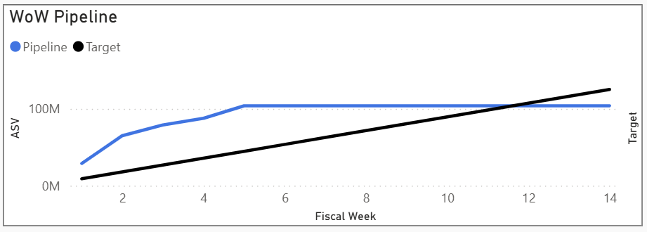

This DAX formula generates a cumulative sum of ContractValue up to a given fiscal week, while preserving the filter context for those dimensions so that only relevant report slicers affect it. 
Image below shows one use case.





```dax
CALCULATE(
    SUM(SalesPipeline[ContractValue]),
    FILTER(
        ALLEXCEPT(
            SalesPipeline, 
            'FiscalQuarter'[Quarter], 
            'SalesRepList'[Rep], 
            'SalesTeamList'[PrimaryTeam], 
            'MarketSegmentList'[Market], 
            'SalesManagerList'[Manager],
            SalesPipeline[PipelineOwner],
            SalesPipeline[Region],
            Region[RegionName],
            SalesPipeline[DealStageNumber],
            SalesPipeline[ClosedLostNonPipelineFlag],
            'ProductCategories'[PrimaryProductGroup],
            SalesPipeline[ClosePeriodFilter],
            'DealStatus'[ActiveOrStalled],
            DealStages[StageName]
        ),
        SalesPipeline[Stage3FiscalWeek] <= MAX(FiscalWeek[FiscalWeekNumber])
    )


