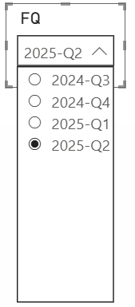

This DAX formula dynamically determines the current fiscal quarter using TODAY() and LOOKUPVALUE, then calculates a filter for the previous three quarters. Good for future-proofing a slicer. 





```dax
Last4ClosedQuarters =
VAR CQ = TODAY()
VAR LastClosedQuarterStart =
    STARTOFQUARTER(EDATE(CQ, -3))   -- go back 1 closed quarter
VAR CQ_Formatted =
    FORMAT(LastClosedQuarterStart, "YYYY") & "-Q" & QUARTER(LastClosedQuarterStart)
VAR QTR_NUM =
    LOOKUPVALUE(
        FQ_FY_CLOSE_FILTER[FQ_Count],
        FQ_FY_CLOSE_FILTER[FQ],
        CQ_Formatted
    )
RETURN
    DISTINCT (
        SELECTCOLUMNS (
            FILTER (
                FQ_FY_CLOSE_FILTER,
                FQ_FY_CLOSE_FILTER[FQ_Count] >= QTR_NUM - 3 &&
                FQ_FY_CLOSE_FILTER[FQ_Count] <= QTR_NUM
            ),
            "FQ", FQ_FY_CLOSE_FILTER[FQ]
        )
    )
