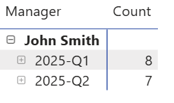

This DAX formula finds the person who manages each rep depending on the fiscal quarter. This is useful for keeping track of reps changing teams so that when one filtes to a particular fiscal quarter and manager, the reps shown are always correct. 





```dax
Team_Lead_Structure = 
    SWITCH(
        Sales_Performance_Overview[Fiscal_Period],
        "2022-Q1", LOOKUPVALUE('Q1_2022_Org_Chart'[Team_Lead], 'Q1_2022_Org_Chart'[Rep_ID], Sales_Performance_Overview[Rep_Name]),
        "2022-Q2", LOOKUPVALUE('Q2_2022_Org_Chart'[Team_Lead], 'Q2_2022_Org_Chart'[Rep_ID], Sales_Performance_Overview[Rep_Name]),
        "2022-Q3", LOOKUPVALUE('Q3_2022_Org_Chart'[Team_Lead], 'Q3_2022_Org_Chart'[Rep_ID], Sales_Performance_Overview[Rep_Name]),
        "2022-Q4", LOOKUPVALUE('Q4_2022_Org_Chart'[Team_Lead], 'Q4_2022_Org_Chart'[Rep_ID], Sales_Performance_Overview[Rep_Name]),

        "2023-Q1", LOOKUPVALUE('Q1_2023_Org_Chart'[Team_Lead], 'Q1_2023_Org_Chart'[Rep_ID], Sales_Performance_Overview[Rep_Name]),
        "2023-Q2", LOOKUPVALUE('Q2_2023_Org_Chart'[Team_Lead], 'Q2_2023_Org_Chart'[Rep_ID], Sales_Performance_Overview[Rep_Name]),
        "2023-Q3", LOOKUPVALUE('Q3_2023_Org_Chart'[Team_Lead], 'Q3_2023_Org_Chart'[Rep_ID], Sales_Performance_Overview[Rep_Name]),
        "2023-Q4", LOOKUPVALUE('Q4_2023_Org_Chart'[Team_Lead], 'Q4_2023_Org_Chart'[Rep_ID], Sales_Performance_Overview[Rep_Name]),
        
        "2024-Q1", LOOKUPVALUE('Q1_2024_Org_Chart'[Team_Lead], 'Q1_2024_Org_Chart'[Rep_ID], Sales_Performance_Overview[Rep_Name]),
        "2024-Q2", LOOKUPVALUE('Q2_2024_Org_Chart'[Team_Lead], 'Q2_2024_Org_Chart'[Rep_ID], Sales_Performance_Overview[Rep_Name]),
        "2024-Q3", LOOKUPVALUE('Q3_2024_Org_Chart'[Team_Lead], 'Q3_2024_Org_Chart'[Rep_ID], Sales_Performance_Overview[Rep_Name]),
        "2024-Q4", LOOKUPVALUE('Q4_2024_Org_Chart'[Team_Lead], 'Q4_2024_Org_Chart'[Rep_ID], Sales_Performance_Overview[Rep_Name])
    )

