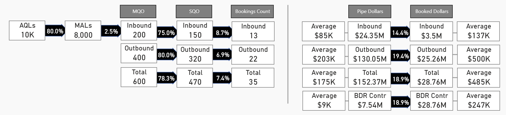

This was the first funnel view showing leads to booked with conversion rates ever created for this org at Adobe. I worked closely with Marketing to ensure my data was in sync with theirs. With expanded visibility into the wide range of conversion rates, BDRs and Marketing entered a new era of collaboration on lead routing practices and Marketing lead quality accountability. 

-AQLs and MALs help track the volume and conversion rate from initial leads to qualified opportunities, allowing managers to assess lead generation effectiveness.
-Inbound and Outbound metrics show the success rates of different lead sources, enabling targeted resource allocation.
-SQO and Booking Count provide insight into the progression from qualified opportunities to closed deals, highlighting conversion efficiency.
-Pipe Dollars and Booked Dollars offer a financial perspective on potential and actual revenue, aiding in forecasting and quota setting.
-Average deal sizes help identify high-value segments to prioritize.
-BDR Contribution quantifies the impact of business development reps, guiding staffing and training decisions.

Note: I changed all numbers to maintain confidentiality. 

