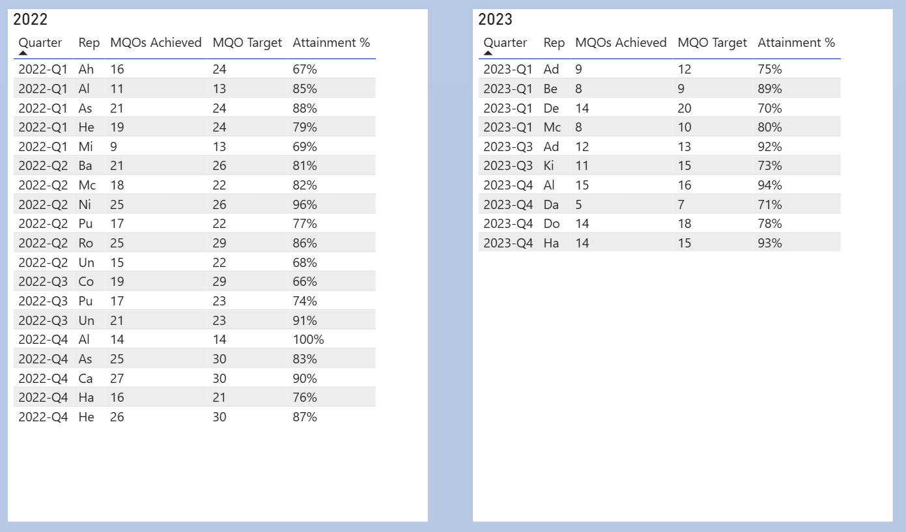

This DAX formula calculates individual targets by dividing team targets by team sizes across multiple years and quarters. This is useful when targets are set at team level and you need to automate individual target calculation.





```dax
MQO_Target_By_Rep = 
VAR CurrentRep = Sales_Data[Rep]
VAR CurrentYearQuarter = Sales_Data[Created_Quarter]
VAR CurrentYear = LEFT(CurrentYearQuarter, 4)
VAR CurrentQuarter = RIGHT(CurrentYearQuarter, 2)
VAR Team = 
    CALCULATE(
        SELECTEDVALUE(Team_Assignments[Goal_Team]),
        Team_Assignments[Year] = CurrentYear,
        Team_Assignments[Quarter] = CurrentQuarter,
        Team_Assignments[Rep] = CurrentRep
    )
VAR TeamSize = 
    CALCULATE(
        SELECTEDVALUE(Team_Sizes[Team_Size]),
        Team_Sizes[Year] = CurrentYear,
        Team_Sizes[Quarter] = CurrentQuarter,
        Team_Sizes[Sales_Team] = 
            CALCULATE(
                SELECTEDVALUE(Team_Assignments[Sales_Team]),
                Team_Assignments[Year] = CurrentYear,
                Team_Assignments[Quarter] = CurrentQuarter,
                Team_Assignments[Rep] = CurrentRep
            )
    )
VAR TeamGoal = 
    CALCULATE(
        SELECTEDVALUE(Goals[Goal_Amount]),
        Goals[Year] = CurrentYear,
        Goals[Quarter] = CurrentQuarter,
        Goals[Goal_Team] = Team
    )
RETURN
    IFERROR(
        ROUND(
            DIVIDE(TeamGoal, TeamSize, 0),
            0
        ),
        0
    )
